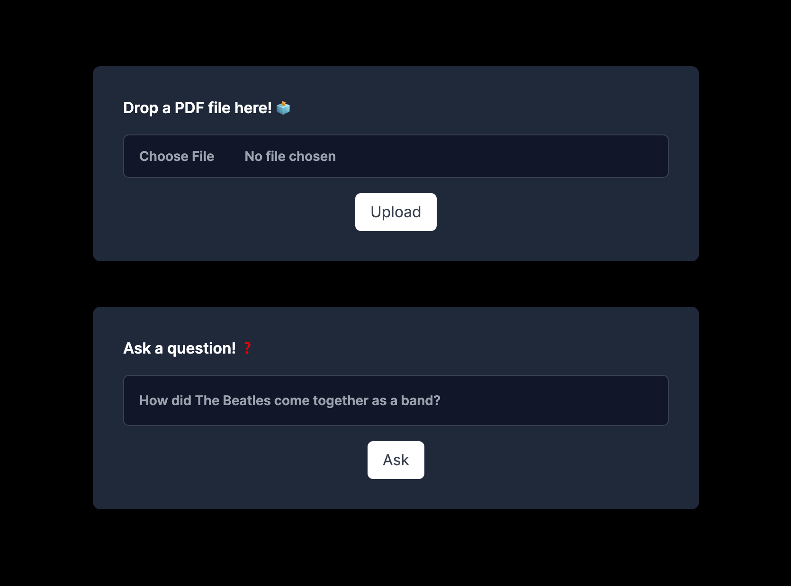

This is a [Next.js](https://nextjs.org/) project bootstrapped with [`create-next-app`](https://github.com/vercel/next.js/tree/canary/packages/create-next-app).

# ChatPDF



This is a demo application for a Next.js Application that allows anyone to upload a PDF document and then ask Questions to GPT about it.

## Getting Started

First, run the development server:

```bash
npm run dev
# or
yarn dev
# or
pnpm dev
```

Open [http://localhost:3000](http://localhost:3000) with your browser to see the result.

## Required Environment Variables

Create an .env.local file at the root directory in order to make this work.

```bash
PINECONE_API_KEY=""
PINECONE_ENVIRONMENT=""
OPENAI_API_KEY=""
```
